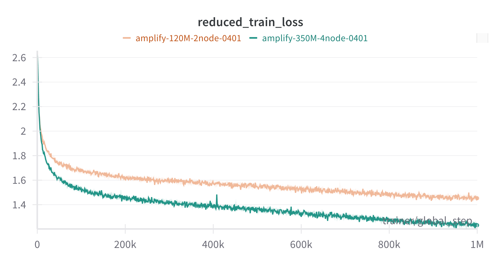
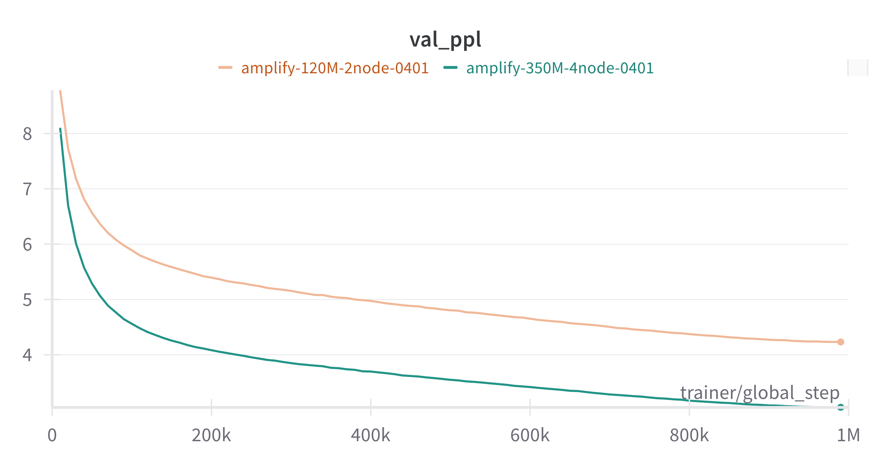

## Model Overview

### Description

A NeMo and Megatron-LM compatible version of the [AMPLIFY model](https://www.biorxiv.org/content/10.1101/2024.09.23.614603v1),
a protein language model variant of ESM-2 with modified layer structure and dataset construction. The model is designed
for protein sequence understanding and prediction tasks, with variants available at 120M and 350M parameter sizes.

This model is ready for commercial use.

### Third-Party Community Consideration

This model is not owned or developed by NVIDIA. This model has been developed and built to a third-party's requirements
for this application and use case; see the [Chandar Lab website](https://chandar-lab.github.io/).

### References

[1] Protein Language Models: Is Scaling Necessary? Quentin Fournier, Robert M. Vernon, Almer van der Sloot, Benjamin
Schulz, Sarath Chandar, Christopher James Langmead bioRxiv 2024.09.23.614603; doi:
[https://doi.org/10.1101/2024.09.23.614603](https://doi.org/10.1101/2024.09.23.614603)

### Model Architecture

**Architecture Type:** Transformer

**Network Architecture:** ESM-2 variant with modified layer structure

### Input

**Input Type(s):** Text (Protein Sequences)

**Input Format(s):** String

**Input Parameters:** 1D

**Other Properties Related to Input:** Protein sequence represented as a string of canonical amino acids.

### Output

**Output Type(s):** Embeddings (Amino acid and sequence-level)

**Output Format:** Numeric vector

**Output Parameters:** 1D

**Other Properties Related to Output:** Numeric vector with floating-point values corresponding to an embedding for each amino acid in the input protein sequence.

### Software Integration

**Runtime Engine(s):**

- BioNeMo, NeMo, Megatron-LM

**Supported Hardware Microarchitecture Compatibility:**

- NVIDIA Ampere
- NVIDIA Hopper

**[Preferred/Supported] Operating System(s):**

- Linux

### Model Versions

The model is fully compatible with weights distributed via HuggingFace, i.e.,
[chandar-lab/AMPLIFY_120M](https://huggingface.co/chandar-lab/AMPLIFY_120M). To initialize a NeMo version of AMPLIFY
from a HuggingFace tag, use the provided `HFAMPLIFYImporter`:

```python
module = biobert_lightning_module(config=AMPLIFYConfig())
io.import_ckpt(module, f"hf://chandar-lab/AMPLIFY_120M", tmp_path / "nemo_checkpoint")
```

## Training & Evaluation

### Training Dataset

The model was trained on a curated dataset of protein sequences following similar principles to ESM-2's training data.
For more details on the training dataset, see the original AMPLIFY paper.

### Inference

**Engine:** BioNeMo, NeMo

**Test Hardware:**

- NVIDIA H100

## License

AMPLIFY is provided under the Apache 2.0 license.

## Pre-training Performance

??? Example "Example pre-training commands"

    === "120M"

        ```
        python /workspace/bionemo-framework/sub-packages/bionemo-amplify/src/bionemo/amplify/train_amplify.py \
            ...
            --num-nodes=2 \
            --devices=8 \
            --min-seq-length 512 \
            --max-seq-length 512 \
            --num-layers 24 \
            --num-attention-heads 10 \
            --hidden-size 640 \
            --ffn-hidden-size 2560 \
            --micro-batch-size 256
        ```

    === "350M"

        ```
        python /workspace/bionemo-framework/sub-packages/bionemo-amplify/src/bionemo/amplify/train_amplify.py \
            ...
            --num-nodes=4 \
            --devices=8 \
            --min-seq-length 512 \
            --max-seq-length 512 \
            --num-layers 32 \
            --num-attention-heads 15 \
            --hidden-size 960 \
            --ffn-hidden-size 3840 \
            --micro-batch-size 128
        ```

| Model Size | GPUs             | Batch Size (per GPU) | Training Step Time (s) |
| ---------- | ---------------- | -------------------- | ---------------------- |
| 120M       | 16 x NVIDIA H100 | 256                  | 0.461                  |
| 350M       | 32 x NVIDIA H100 | 128                  | 0.525                  |

## Model Convergence

Model convergence curves are shown below for the 120M and 350M models, trained on the [chandar-lab/UR100P](https://huggingface.co/datasets/chandar-lab/UR100P/tree/main) dataset for 1M steps.

<div class="grid grid-cols-3" markdown>

{ width="600" }

{ width="600" }

{ width="600" }

</div>

## Final Perplexities by Model Size

| Model Size | Perplexity at 1M Steps |
| ---------- | ---------------------- |
| 120M       | 4.23                   |
| 350M       | 3.05                   |
